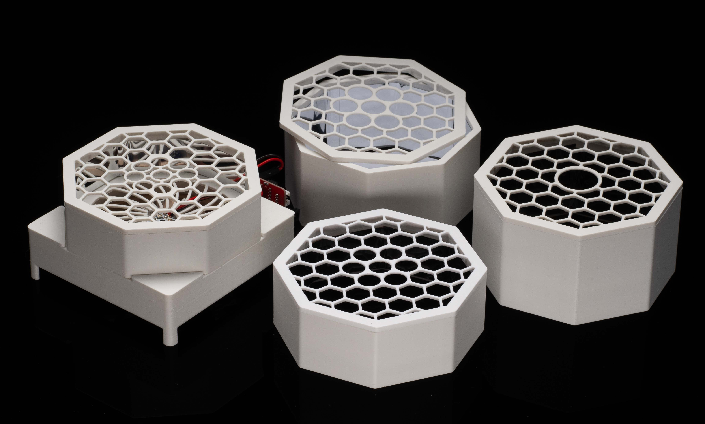

# Wisconsin Photoreactor Platform (WPP)

An open source photoreactor platfrom. 3D printed enclosure, commercially avaliable components, and a little bit of custom circuitry.

## Repository

This is an open source hardware project licensed under the CERN Open Hardware Licence Version 2 - Permissive.
Please see the LICENSE file for the complete license.

This repository is being mirrored to several version control systems in an attempt to ensure maximum avaliability.

| name             | url                                                             |
| ---------------- | --------------------------------------------------------------- |
| Chem             | https://git.chem.wisc.edu/gellman-group/wisconsin-photoreactor  |
| GitHub (primary) | https://github.com/uw-madison-chem-shops/wisconsin-photoreactor |
| GitLab           | https://gitlab.com/uw-madison-chem-shops/wisconsin-photoreactor |

## Safety

The Wisconsin Photoreactor is for use by trained chemistry researchers and should be handled carefully.

WPP apparatuses utilize high-intensity light emitting diodes (LED) that can cause eye damage if proper safety precautions are not observed. 
Light-filtering safety glasses should be worn whenever a WPP apparatus photon source is powered. 
Care must be taken to use safety glasses protective against the specific emission wavelengths of a photon source.

## Frabication and Operation Instructions

This repository contains detailed instructions for fabrication, operation and documentation of WPP devices.
Please see [wpp-assembly.pdf](./assembly-instructions/wpp-assembly.pdf)

## Enclosure

The WPP is designed around a mechanically robust 3D printed enclosure.
Every WPP device has the same base, see directory `photoreactor-base`.
WPP reaction modules are meant to be switched based on the reaction vessel used.
See directory `photoreactor-tops` for our growing collection of reaction modules for common vessel types.

## Electronics

The WPP incorporates small custom circuit boards providing control over light intensity and fan speed.
Please see the fabrication instructions for more detailed information.