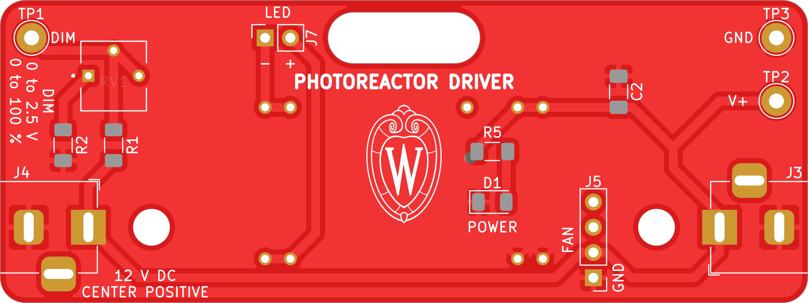
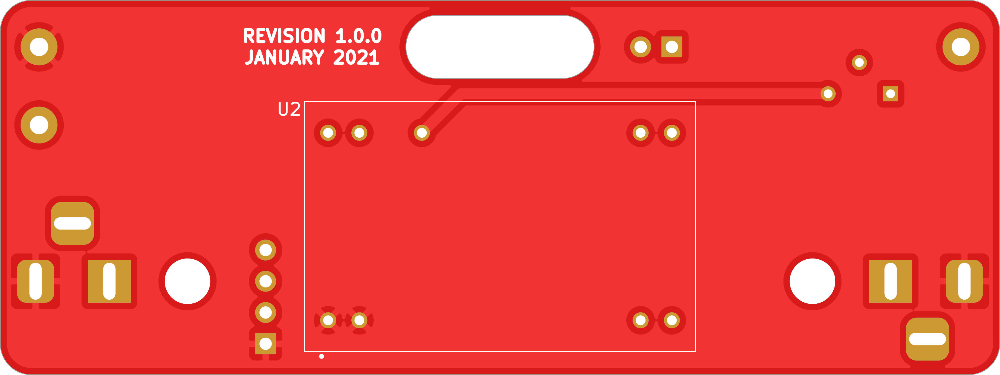

# analog driver

A photoreactor driver board with a physical knob.

## PCB

This PCB was designed using KiCAD version 5.
Refer to `driver.pdf` for schematic.
PCB images generated with [tracespace](https://github.com/tracespace/tracespace) follow.

Bill of Materials

| reference      | value         | manufacturer | part number    | vendors |
| :------------- | :------------ | :----------- | :------------- | :------ |
| C2             | 10u           |              |                |         |
| D1             | (red)         |              |                |         |
| J3, J4         | Barrel Jack   |              |                |         |
| J5             | fan connector |              |                |         |
| J7             | LED connector |              |                |         |
| R1             | 10k           |              |                |         |
| R2             | 470           |              |                |         |
| R5             | 1k            |              |                |         |
| RV1            | 2.2k          | Bourns       | 3362P-1-202TLF |         |
| TP1            | (yellow)      | Keystone     | 5014           |         |
| TP2            | (red)         | Keystone     | 5010           |         |
| TP3            | (black)       | Keystone     | 5011           |         |
| U2             | LED driver    | Mean Well    | LDD-1000L      | [DigiKey](https://www.digikey.com/en/products/detail/mean-well-usa-inc/LDD-1000L/7704722) [Allied](https://www.alliedelec.com/product/mean-well/ldd-1000l/70345765/) |

## Changelog

### Unprinted

#### Fixed
- sign of LED terminals on silkscreen
- voltage divider: R1 to 6.8k R2 to 100 ohm
- adjusted voltage divider silkscreen

### Revision A

#### Added
- initial design
