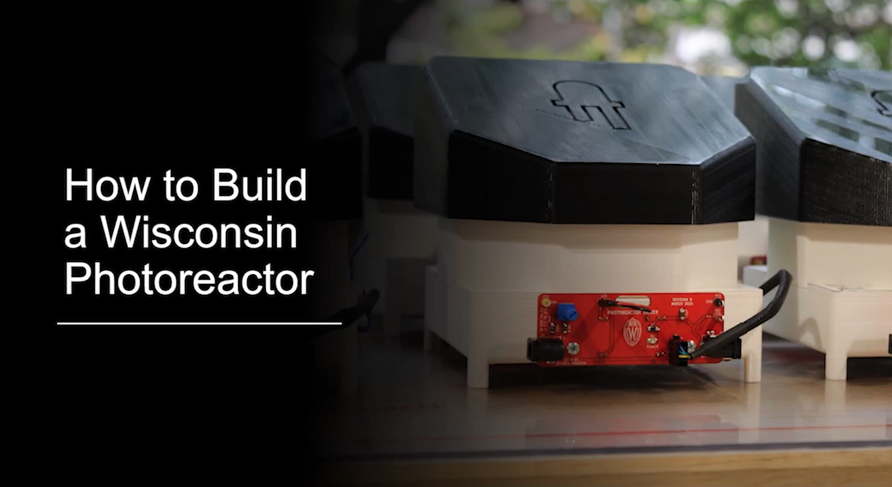

## Fabrication and Operation Instructions

Detailed instructions for fabrication, operation and documentation of WPP devices are available in [wpp-fabrication-operation.pdf](./fabrication-and-operation-instructions/wpp-fabrication-operation.pdf)

A video guide covering part sourcing, 3D-printing, electronics manufacturing, assembly and use of Wisconsin photoreactors is available on [youtube](http://www.youtube.com/watch?v=fkLr17i4FgE)

