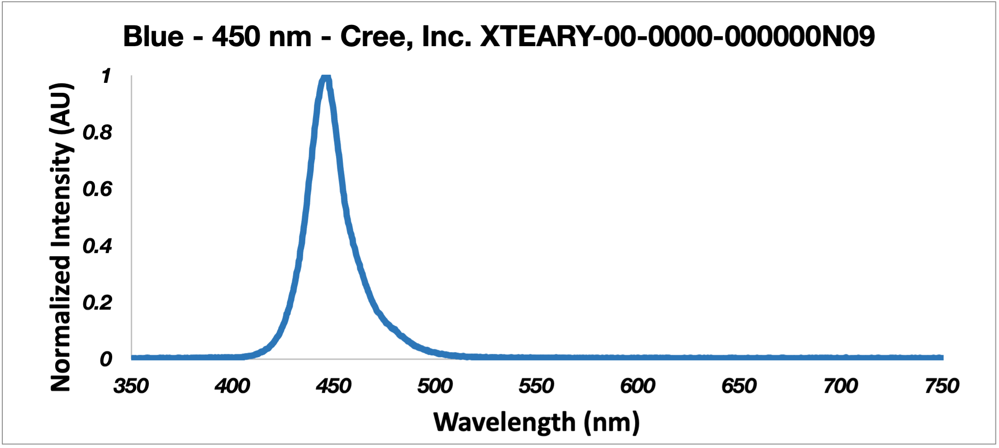
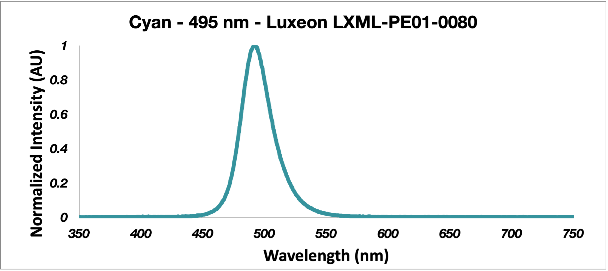
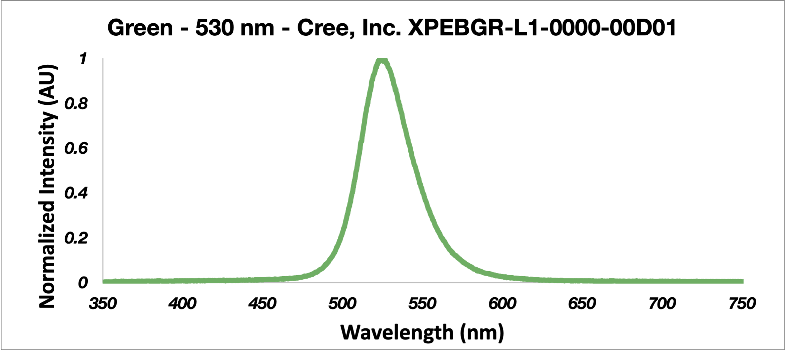
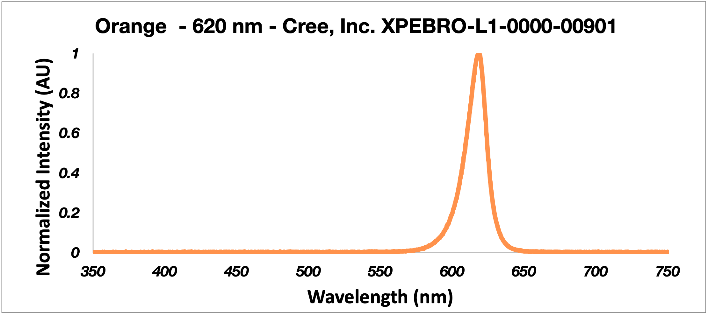
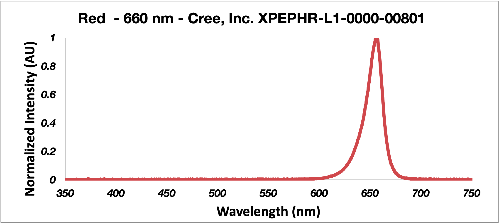

# Photon Source LEDS

The WPP photon source consists of 3 high-power, single-color LEDs mounted onto an industry-standard 20 mm LED star package. 

WPP-compatible LED stars emitting narrow wavelength ranges across the UV-Visible spectrum are available from multiple vendors. A few are detailed below.

WPP-compatible custom LED stars mounted with 3.5 mm surface mount LEDs of any wavelength can be fabricated using a reflow oven. Please see [wpp-fabrication-operation.pdf](./fabrication-and-operation-instructions/wpp-fabrication-operation.tex) for fabrication instructions for more information.

## List of compatible commercial LED stars

| color          | max emission | manufacturer | manufacturer part number | LEDsupply LED star part number | LEDsupply price | LED Star vendors | LED vendors |
| :------------- | :----------- | :----------- | :----------------------- | :----------------------------- | :-------------- | :--------------- | :------------ |
| UVA            | 365 nm       | Inolux       | IN-C39CTOU2 	     	   | N/A (mounted by user)	        | N/A                | N/A | [DigiKey](https://www.digikey.com/en/products/detail/inolux/IN-C39CTOU2/9681227) [Mouser](https://www.mouser.com/ProductDetail/Inolux/IN-C39CTOU2/?qs=qSfuJ%252Bfl%2Fd4759YPTEyoag%3D%3D) |
| Violet         | 400 nm       | Inolux       | IN-C39CTOU5		       | N/A (mounted by user)          | N/A                | N/A | [DigiKey](https://www.digikey.com/en/products/detail/inolux/IN-C39CTOU5/9681233) [Mouser](https://www.mouser.com/ProductDetail/Inolux/IN-C39CTOU5/?qs=qSfuJ%252Bfl%2Fd6BLbca08ZG2g%3D%3D) |
| Blue           | 450 nm       | Cree, Inc.   | XTEARY-00-0000-000000N09  | CREEXTE-ROY-3	                | $10.10         | [LEDSupply](https://www.ledsupply.com/leds/cree-xlamp-xt-e-royal-blue-leds) | [DigiKey](https://www.digikey.com/en/products/detail/cree-inc/XTEARY-00-0000-000000N09/3744336) [Mouser](https://www.mouser.com/ProductDetail/Cree-Inc/XTEARY-00-0000-000000N09?qs=ygRr%2Ftkhtevu4HqMzfGc3w%3D%3D) |
| Cyan           | 495 nm       | Luxeon       | LXML-PE01-0080	    	   | 07007-PE000-K	                | $12.60           | [LEDSupply](https://www.ledsupply.com/leds/luxeon-rebel-color-leds) | [DigiKey](https://www.digikey.com/en/products/detail/lumileds/LXML-PE01-0080/3961255) [Mouser](https://www.mouser.com/ProductDetail/Lumileds/LXML-PE01-0080/?qs=7Vwje68bFtO%2F0g2M%252BAMdYQ%3D%3D) |
| Green          | 530 nm       | Cree, Inc.   | XPEBGR-L1-0000-00D01      | CREEXPE2-GRN-3		            | $10.50           | [LEDSupply](https://www.ledsupply.com/leds/cree-xlamp-xp-e2-color-high-power-led-star) | [DigiKey](https://www.digikey.com/en/products/detail/cree-inc/XPEBGR-L1-0000-00D01/4177200) [Mouser](https://www.mouser.com/ProductDetail/Cree-Inc/XPEBGR-L1-0000-00D01/?qs=rHlcMk0NooK%2FtCgm9PQ0pQ%3D%3D) |
| Amber          | 590 nm       | Luxeon       | LXML-PL01-0060		       | 07007-PL000-F	                | $12.60           | [LEDSupply](https://www.ledsupply.com/leds/luxeon-rebel-color-leds) | [DigiKey](https://www.digikey.com/en/products/detail/lumileds/LXML-PL01-0050/3961256) [Mouser](https://www.mouser.com/ProductDetail/Lumileds/LXML-PL01-0060?qs=7Vwje68bFtP0H6dN9OA%2FuA%3D%3D) |
| Orange         | 620 nm       | Cree, Inc.   | XPEBRO-L1-0000-00901	   | CREEXPE2-RDO-3                 | $10.50           | [LEDSupply](https://www.ledsupply.com/leds/cree-xlamp-xp-e2-color-high-power-led-star) | [DigiKey](https://www.digikey.com/en/products/detail/cree-inc/XPEBRO-L1-0000-00901/4177164) [Mouser](https://www.mouser.com/ProductDetail/Cree-Inc/XPEBRO-L1-0000-00901?qs=rHlcMk0NooLQklUEc3IqMg%3D%3D) |
| Red            | 660 nm       | Cree, Inc.   | XPEPHR-L1-0000-00801	   | CREEXPE-DRD-3                  | $10.50           | [LEDSupply](https://www.ledsupply.com/leds/cree-xlamp-xpe-high-power-led-star) | [DigiKey](https://www.digikey.com/en/products/detail/cree-inc/XPEPHR-L1-0000-00801/4895013) [Mouser](https://www.mouser.com/ProductDetail/Cree-Inc/XPEPHR-L1-0000-00801/?qs=3izLlwrMQ7lAtbsWL38zog%3D%3D) |
| NIR            | 730 nm       | Cree, Inc.   | XPEFAR-L1-0000-00601	   | CREEXPE-FRD-3	                | $12.00           | [LEDSupply](https://www.ledsupply.com/leds/cree-xlamp-xpe-high-power-led-star) | [DigiKey](https://www.digikey.com/en/products/detail/cree-inc/XPEFAR-L1-0000-00601/5303643) [Mouser](https://www.mouser.com/ProductDetail/Cree-Inc/XPEFAR-L1-0000-00601?qs=k72kBymvut%252B0JKg4b6%252BzNg%3D%3D) |

All prices are in USD.
In general, prices are overestimates, thereby providing an upper estimate on cost.

## Commercial LED emission spectra

LED emission spectra below were measured using an Ocean Insight USB2000 Spectrometer loaned by the [Goldsmith Group](https://goldsmith.chem.wisc.edu).

## Ordering Blank LED stars

The WPP base is designed to fit an industry-standard, 20 mm [Indus Star A008 high power LED modules](https://leddynamics.com/indus-star-a007-a008).

To order blank Indus Star A008 LED stars for custom LED star creation, contact [LEDsupply](https://www.ledsupply.com/contact-us), [LEDdynamics](https://leddynamics.com/contact-us) or other vendors.
