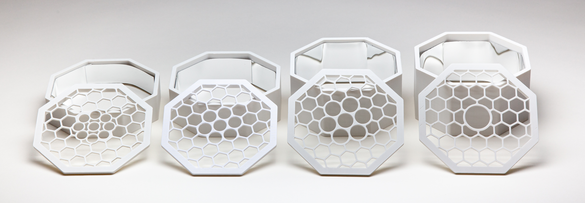

# Photoreactor Reaction Modules

A WPP reaction module consists of a reflective reaction chamber and rigid vessel holder. 

By modifying chamber height and adjusting holder geometry, one can produce modules compatible with reaction vessels of various types and sizes. 
Template reaction chamber and vessel holder CAD designs are provided in the `template` directory. 

CAD designs and 3D-printable models for modules compatible with various common reaction vessel are provided in this directory. A table listing vessels with already created reaction modules is offered below. 

## Reaction vessels with compatible modules

| vessel         | manufacturer       | manufacturer part number  |
| :------------- | :----------------- | :------------------------ |
| 2 mL Vial      | Fisher Scientific  | 03-338AA                  |
| 4 mL Vial      | Chemglass          | CG-4909-04                | 
| 8 mL Vial      | Chemglass          | CG-4909-03                |
| 10 mL Schlenk  | Synthware          | F580010	                  |
| 24 mL Vial     | VWR                | Vial: VWR 66012-044 Cap: Chemglass CG-4911-20 |

## Bill of Materials

The interior of WPP reaction chambers should be covered with reflective material. One option is offered below.

| reference         | manufacturer | part number       | price  | vendors |
| :---------------- | :----------- | :---------------- | :----- | :------ |
| mirror sheet      | Aneco        | 	B075R3MMX1       | $10.00 | [Amazon](https://www.amazon.com/gp/product/B075R3MMX1) |
